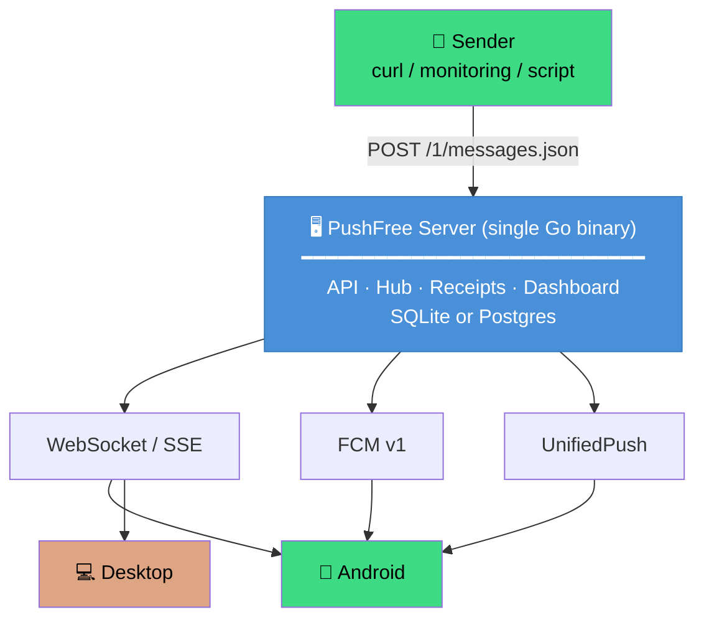

# PushFree

**Self-hosted push notifications. No per-message fees.**

[](LICENSE)
[](https://go.dev)
[](https://developer.android.com)
[](https://tauri.app)
[](https://pushover.net)

[한국어](README.md) | **[English](README.en.md)**

PushFree is a self-hostable, [Pushover](https://pushover.net)-API-compatible
push notification service. A single small Go binary serves the API, the
realtime WebSocket/SSE fan-out, and the embedded admin dashboard — no external
dependencies, no cgo, no per-message pricing. If your tool already speaks
Pushover's `messages.json`, point it at PushFree and it just works.

```
curl -X POST https://your-pushfree/1/messages.json \
  -d "token=$TOKEN" -d "user=$USERKEY" -d "message=hello"
```

---

## At a Glance

<table>
  <tr>
    <td width="50%" align="center"><b>🌐 Admin Dashboard</b></td>
    <td width="50%" align="center"><b>📱 Android Client</b></td>
  </tr>
  <tr>
    <td width="50%"></td>
    <td width="50%"></td>
  </tr>
  <tr>
    <td width="50%" align="center"><sub>App tokens, live messages, quota, quiet hours</sub></td>
    <td width="50%" align="center"><sub>Server subscriptions, notifications, emergency ack</sub></td>
  </tr>
  <tr>
    <td width="50%"></td>
    <td width="50%"></td>
  </tr>
  <tr>
    <td width="50%" align="center"><sub>Monthly quota & rate-limit headers</sub></td>
    <td width="50%" align="center"><sub>WebSocket / FCM / UnifiedPush transport</sub></td>
  </tr>
</table>

<details>
<summary>📱 More Screenshots</summary>

| Android: Add Server | Android: Settings | Dashboard: Apps | Dashboard: Quiet Hours |
|---|---|---|---|
|  |  |  |  |

</details>

---

## Why PushFree?

| Pushover | PushFree |
|----------|----------|
| $0.005 per message | **Unlimited, free** |
| Cloud-hosted | **Self-hosted** — your data stays on your server |
| Closed source | **Apache-2.0 open source** |
| Limited transports | **WebSocket + SSE + FCM + UnifiedPush** |
| 10k messages/month cap | **Configurable** (default 10,000/user/month) |

---

## Architecture



One Go binary does everything — no external services, no message broker, no database server required (SQLite is embedded).

---

## Quick Start

### 1. Start the Server (30 seconds)

**Docker (recommended):**
```sh
docker build -t pushfree server/
docker compose -f deploy/docker-compose.yml up -d
curl localhost:2586/health   # → {"status":"ok"}
```

**Binary:**
```sh
# Download from releases, or build from source:
cd server && go build -o pushfree ./cmd/pushfree
./pushfree                    # ← runs on :2586 with zero config
```

### 2. Send Your First Message

```sh
# Create admin account (first signup is automatically admin)
curl -X POST localhost:2586/v1/accounts \
  -H 'Content-Type: application/json' \
  -d '{"email":"me@example.com","password":"correct-horse"}'

# Log in + create an app token
curl -sc c.txt -X POST localhost:2586/v1/accounts/login \
  -H 'Content-Type: application/json' \
  -d '{"email":"me@example.com","password":"correct-horse"}'
TOKEN=$(curl -sb c.txt -X POST localhost:2586/v1/apps \
  -H 'Content-Type: application/json' -d '{"name":"grafana"}' | sed -E 's/.*"token":"([^"]+)".*/\1/')
UK=$(curl -sb c.txt localhost:2586/v1/accounts/me | sed -E 's/.*"user_key":"([^"]+)".*/\1/')

# Send! (identical to Pushover's API)
curl -X POST localhost:2586/1/messages.json \
  -d "token=$TOKEN" -d "user=$UK" \
  -d "message=Build passed ✅" -d "priority=1"
```

### 3. Connect Clients

- **Android**: Download the [release APK](https://github.com/MovieHolic-Plex/pushfree/releases) → enter server URL → WebSocket/FCM auto-connects
- **Desktop**: `cd desktop && cargo tauri build` → receive notifications in the system tray
- **Dashboard**: Open `http://your-server:2586/admin/` in your browser

---

## Key Features

### 🚀 Full Pushover Compatibility
Every field of `POST /1/messages.json` is supported — priorities `-2..2`, attachments, HTML/monospace, tags, callbacks, E2EE encryption. Existing Pushover integrations work with a URL change.

### 🔔 Emergency (Priority-2) Alerts
A durable retry scheduler (30s interval, 3h expire, 50-attempt cap) repeats the notification until the user acknowledges it. Full receipt state machine, cancel-by-tag, webhook callback.

### 📡 Multi-Channel Delivery
| Channel | Use Case | Notes |
|---------|----------|-------|
| **WebSocket** | First-class transport | `since`-cursor replay, 45s keepalive |
| **SSE** | Browser / fallback | PushFree addition (Pushover has no SSE) |
| **FCM v1** | Android background | Optional, env-gated |
| **UnifiedPush** | De-Googled Android | Built-in distributor endpoint |

### 🔒 End-to-End Encryption
Message title/body encrypted with AES-256-CBC + HMAC — the server stores only ciphertext and never decrypts. Cross-validated across Go, Kotlin, and Rust with shared test vectors.

### 🗄️ Dual Database Backend
- **SQLite** (default) — zero-config, pure-Go driver, single file
- **Postgres** — switch with one config line (`db-url`), `pgx/v5` driver

### 📊 Built-in Dashboard
A Next.js static export is embedded into the Go binary via `go:embed`. Manage app tokens, watch live messages over SSE, inspect quota, and configure quiet hours — all from the browser.

### 🌙 Quiet Hours
`priority <= 0` messages are held during the configured window; `priority >= 1` bypasses quiet hours.

---

## Project Layout

```text
pushfree/
├── server/          Go server (single binary)
│   ├── cmd/pushfree/           Entry point
│   └── internal/
│       ├── api/                HTTP API (Pushover /1/* + management /v1/*)
│       ├── hub/                Realtime WebSocket/SSE fan-out
│       ├── receipts/           Emergency receipt state machine
│       ├── timers/             Durable retry timer engine
│       ├── callbacks/          Webhook callback worker
│       ├── store/sqlite/       SQLite backend
│       ├── store/postgres/     Postgres backend
│       ├── e2ee/               End-to-end encryption
│       ├── fcm/                FCM v1 delivery (optional)
│       ├── up/                 UnifiedPush distributor
│       └── webmount/           Dashboard go:embed serving
├── android/         Native Android client (Kotlin)
├── desktop/         Tauri 2 desktop client (Rust)
├── web/             Next.js admin dashboard (static export)
├── deploy/          Docker Compose and deployment assets
└── docs/            Documentation
```

---

## Tech Stack

| Layer | Technology |
|-------|-----------|
| **Server** | Go 1.26 · `net/http` · `modernc.org/sqlite` · `pgx/v5` |
| **Android** | Kotlin · Jetpack Compose · Room · WorkManager · WebSocket |
| **Desktop** | Rust · Tauri 2 · `tokio-tungstenite` |
| **Dashboard** | Next.js 15 · React · TailwindCSS · Static Export |
| **Deploy** | Docker (distroless) · GoReleaser · GitHub Actions |

---

## Documentation

- [🚀 Getting Started](docs/getting-started.md)
- [⚙️ Configuration Reference](docs/configuration.md)
- [📡 HTTP API Reference](docs/api.md)
- [🖥️ Self-Hosting Guide (TLS, backups, Postgres)](docs/self-hosting.md)
- [🔄 Pushover Compatibility Matrix](docs/API-COMPAT.md)
- [🏗️ Architecture Deep Dive](ARCHITECTURE.md)

---

## Contributing

Bug reports, feature suggestions, and pull requests are welcome. See [CONTRIBUTING.md](CONTRIBUTING.md).

```sh
# Server tests
cd server && go test ./...

# Android tests
cd android && ./gradlew testPlayDebugUnitTest

# Desktop tests
cd desktop && cargo test
```

---

## License

[Apache License 2.0](LICENSE) © PushFree Contributors
