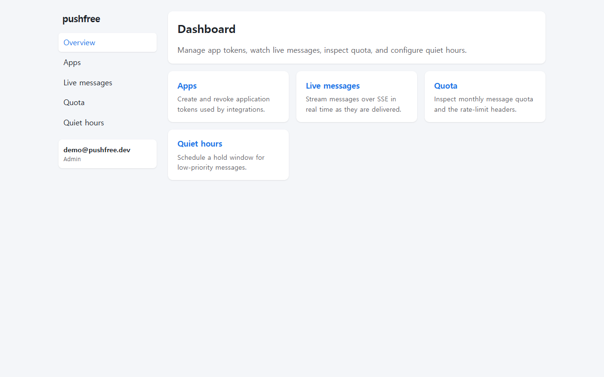
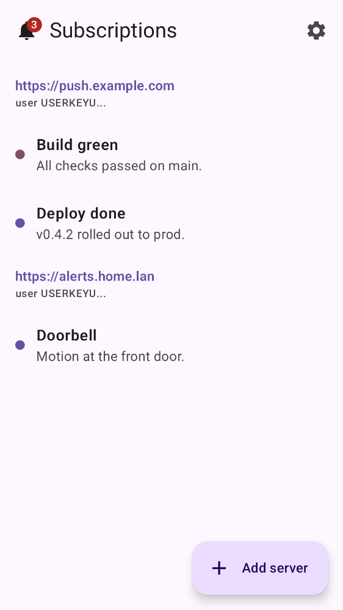
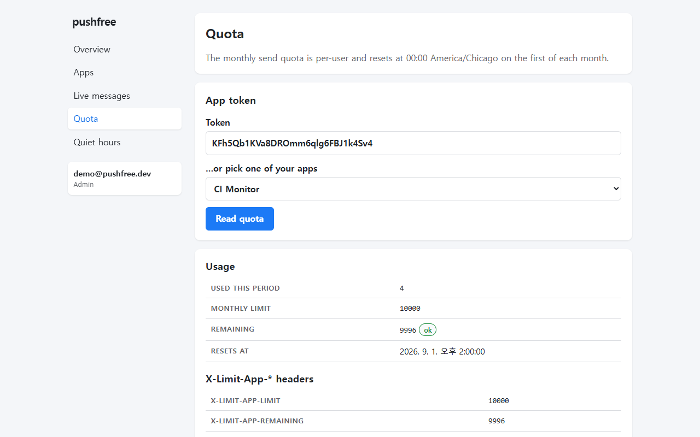
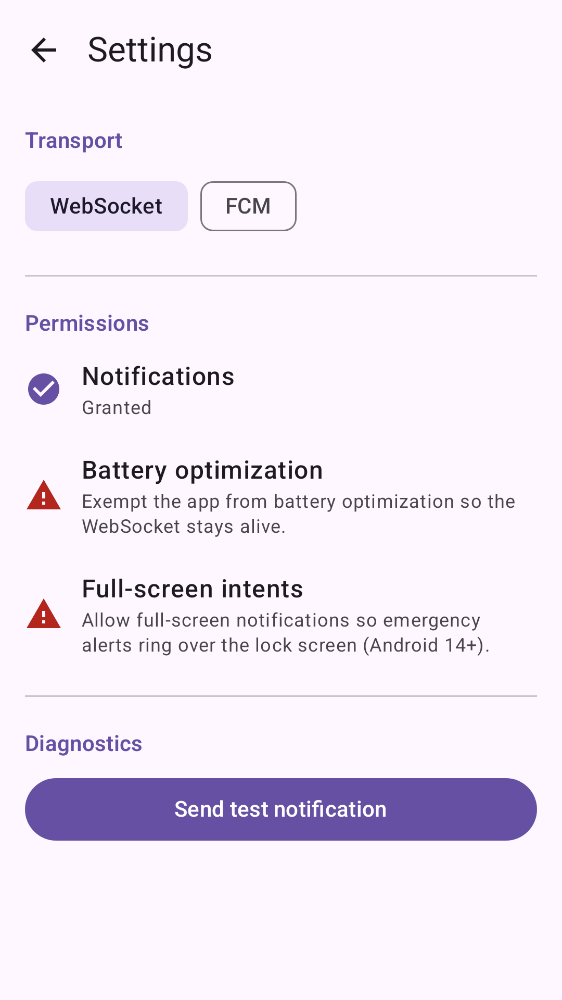
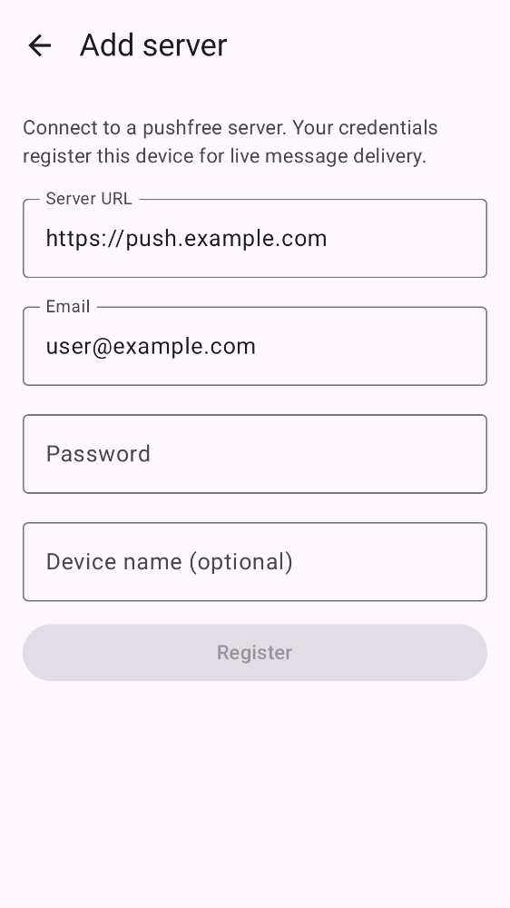
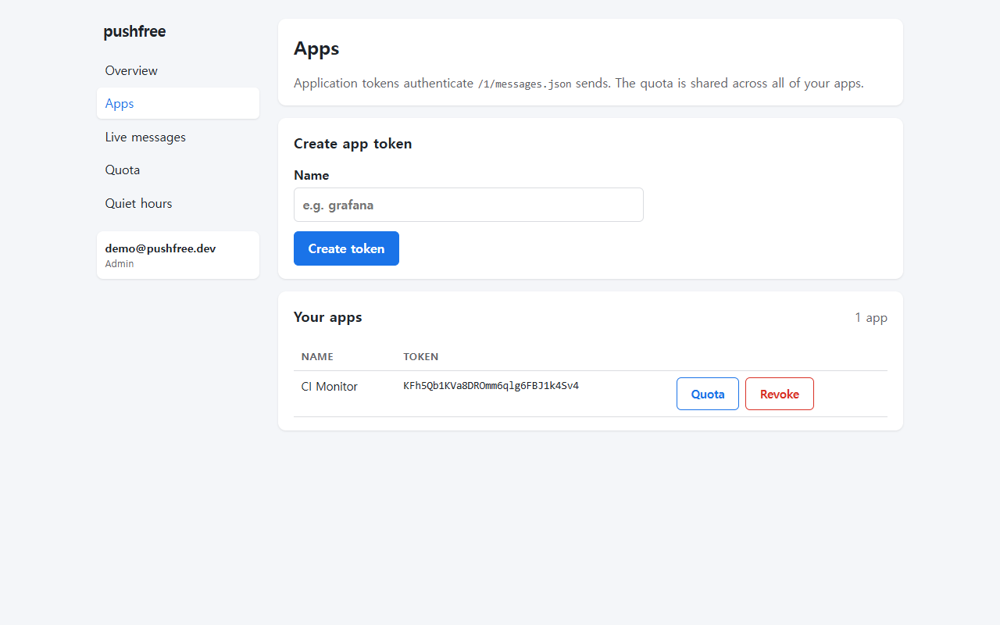
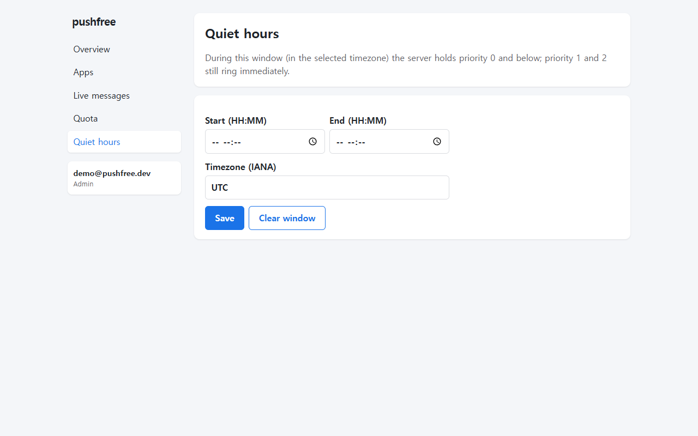
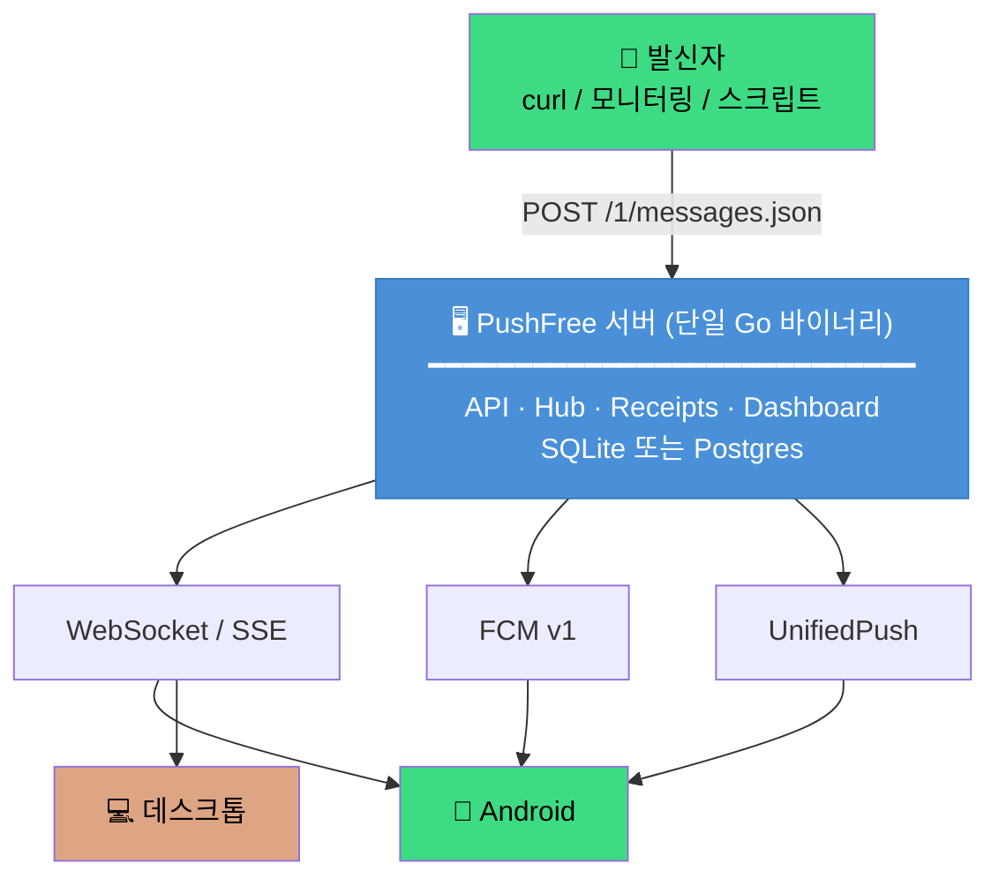

# PushFree

**셀프 호스팅 푸시 알림. 메시지당 요금은 없다.**

[](LICENSE)
[](https://go.dev)
[](https://developer.android.com)
[](https://tauri.app)
[](https://pushover.net)

**[한국어](README.md)** | [English](README.en.md)

PushFree는 [Pushover](https://pushover.net) API와 호환되는 셀프 호스팅 푸시 알림 서비스입니다.
서버는 단일 Go 바이너리로, API · 실시간 WebSocket/SSE 팬아웃 · 관리자 대시보드를 모두 내장합니다.
이미 Pushover의 `messages.json`을 사용하는 도구라면 URL만 바꾸면 그대로 동작합니다.

```
curl -X POST https://your-pushfree/1/messages.json \
  -d "token=$TOKEN" -d "user=$USERKEY" -d "message=hello"
```

---

## 한눈에 보기

<table>
  <tr>
    <td width="50%" align="center"><b>🌐 관리자 대시보드</b></td>
    <td width="50%" align="center"><b>📱 Android 클라이언트</b></td>
  </tr>
  <tr>
    <td width="50%"></td>
    <td width="50%"></td>
  </tr>
  <tr>
    <td width="50%" align="center"><sub>앱 토큰 관리, 실시간 메시지, 할당량, 방해 금지 시간</sub></td>
    <td width="50%" align="center"><sub>서버 구독, 알림 수신, 긴급 ack</sub></td>
  </tr>
  <tr>
    <td width="50%"></td>
    <td width="50%"></td>
  </tr>
  <tr>
    <td width="50%" align="center"><sub>월간 할당량 및 속도제한 헤더</sub></td>
    <td width="50%" align="center"><sub>WebSocket / FCM / UnifiedPush 전송 방식 선택</sub></td>
  </tr>
</table>

<details>
<summary>📱 더 많은 스크린샷</summary>

| Android: 서버 추가 | Android: 설정 | 대시보드: 앱 토큰 | 대시보드: 방해 금지 시간 |
|---|---|---|---|
|  |  |  |  |

</details>

---

## 왜 PushFree인가?

| Pushover | PushFree |
|----------|----------|
| 메시지당 $0.005 과금 | **무제한 무료** |
| 클라우드 호스팅 | **직접 호스팅** — 데이터는 당신의 서버에 |
| 폐쇄 소스 | **Apache-2.0 오픈 소스** |
| 제한된 전송 방식 | **WebSocket + SSE + FCM + UnifiedPush** |
| 월 10,000건 한도 | **설정 가능** (기본값 10,000/사용자/월) |

---

## 아키텍처



단일 Go 바이너리가 모든 것을 처리합니다 — 외부 의존성 없이, cgo 없이, 하나의 실행 파일로.

---

## 빠른 시작

### 1. 서버 실행 (30초)

**Docker (권장):**
```sh
docker build -t pushfree server/
docker compose -f deploy/docker-compose.yml up -d
curl localhost:2586/health   # → {"status":"ok"}
```

**바이너리 직접 실행:**
```sh
# 릴리스에서 다운로드 또는 직접 빌드
cd server && go build -o pushfree ./cmd/pushfree
./pushfree                    # ← 설정 없이 :2586에서 실행
```

### 2. 첫 메시지 보내기

```sh
# 관리자 계정 생성 (첫 가입자가 자동으로 admin)
curl -X POST localhost:2586/v1/accounts \
  -H 'Content-Type: application/json' \
  -d '{"email":"me@example.com","password":"correct-horse"}'

# 로그인 + 앱 토큰 발급
curl -sc c.txt -X POST localhost:2586/v1/accounts/login \
  -H 'Content-Type: application/json' \
  -d '{"email":"me@example.com","password":"correct-horse"}'
TOKEN=$(curl -sb c.txt -X POST localhost:2586/v1/apps \
  -H 'Content-Type: application/json' -d '{"name":"grafana"}' | sed -E 's/.*"token":"([^"]+)".*/\1/')
UK=$(curl -sb c.txt localhost:2586/v1/accounts/me | sed -E 's/.*"user_key":"([^"]+)".*/\1/')

# 전송! (Pushover와 동일한 API)
curl -X POST localhost:2586/1/messages.json \
  -d "token=$TOKEN" -d "user=$UK" \
  -d "message=Build passed ✅" -d "priority=1"
```

### 3. 클라이언트 연결

- **Android**: [릴리스 APK](https://github.com/MovieHolic-Plex/pushfree/releases) 다운로드 → 서버 URL 입력 → WebSocket/FCM 자동 연결
- **데스크톱**: `cd desktop && cargo tauri build` → 시스템 트레이에서 알림 수신
- **대시보드**: 브라우저로 `http://your-server:2586/admin/` 접속

---

## 주요 기능

### 🚀 Pushover 완전 호환
`POST /1/messages.json`의 모든 필드를 지원합니다 — 우선순위 `-2~2`, 첨부파일, HTML/모노스페이스, 태그, 콜백, E2EE 암호화. 기존 Pushover 통합은 URL만 바꾸면 됩니다.

### 🔔 긴급(우선순위 2) 알림
내구성 재시도 스케줄러(30초 간격, 3시간 만료, 최대 50회)가 사용자가 확인할 때까지 반복 알림을 보냅니다. 영수증 상태 머신, cancel-by-tag, 웹훅 콜백을 지원합니다.

### 📡 다중 전송 채널
| 채널 | 용도 | 특징 |
|------|------|------|
| **WebSocket** | 일급 전송 | `since` 커서 재생, 45초 keepalive |
| **SSE** | 브라우저/폴백 | Pushover에는 없는 PushFree 고유 기능 |
| **FCM v1** | Android 백그라운드 | 선택적, 환경변수로 활성화 |
| **UnifiedPush** | Google Play 없는 Android | 자체 디스트리뷰터 |

### 🔒 종단간 암호화 (E2EE)
메시지 제목/본문을 AES-256-CBC + HMAC로 암호화 — 서버는 암호문만 저장하고 절대 복호화하지 않습니다. Go, Kotlin, Rust 세 플랫폼이 동일한 벡터로 상호 검증됩니다.

### 🗄️ 이중 데이터베이스
- **SQLite** (기본값) — 설정 없이 작동, 순수 Go 드라이버, 단일 파일
- **Postgres** — `db-url` 설정 한 줄로 전환, `pgx/v5` 드라이버

### 📊 내장 대시보드
Next.js 정적 익스포트가 Go 바이너리에 `go:embed`로 내장됩니다. 앱 토큰 관리, 실시간 SSE 메시지 뷰, 할당량 확인, 방해 금지 시간 설정을 브라우저에서 바로 사용할 수 있습니다.

### 🌙 방해 금지 시간
`priority <= 0` 메시지를 설정된 시간 동안 보류하고, `priority >= 1`은 방해 금지 시간을 우회합니다.

---

## 프로젝트 구조

```text
pushfree/
├── server/          Go 서버 (단일 바이너리)
│   ├── cmd/pushfree/           진입점
│   └── internal/
│       ├── api/                HTTP API (Pushover 호환 /1/* + 관리 /v1/*)
│       ├── hub/                실시간 WebSocket/SSE 팬아웃
│       ├── receipts/           긴급 영수증 상태 머신
│       ├── timers/             내구성 재시도 타이머 엔진
│       ├── callbacks/          웹훅 콜백 워커
│       ├── store/sqlite/       SQLite 백엔드
│       ├── store/postgres/     Postgres 백엔드
│       ├── e2ee/               종단간 암호화
│       ├── fcm/                FCM v1 전송 (선택)
│       ├── up/                 UnifiedPush 디스트리뷰터
│       └── webmount/           대시보드 go:embed 서빙
├── android/         네이티브 Android 클라이언트 (Kotlin)
├── desktop/         Tauri 2 데스크톱 클라이언트 (Rust)
├── web/             Next.js 관리자 대시보드 (정적 익스포트)
├── deploy/          Docker Compose 및 배포 자산
└── docs/            문서
```

---

## 기술 스택

| 레이어 | 기술 |
|--------|------|
| **서버** | Go 1.26 · `net/http` · `modernc.org/sqlite` · `pgx/v5` |
| **Android** | Kotlin · Jetpack Compose · Room · WorkManager · WebSocket |
| **데스크톱** | Rust · Tauri 2 · `tokio-tungstenite` |
| **대시보드** | Next.js 15 · React · TailwindCSS · 정적 익스포트 |
| **배포** | Docker (distroless) · GoReleaser · GitHub Actions |

---

## 문서

- [🚀 시작하기](docs/getting-started.md)
- [⚙️ 설정 레퍼런스](docs/configuration.md)
- [📡 HTTP API 레퍼런스](docs/api.md)
- [🖥️ 셀프 호스팅 가이드 (TLS, 백업, Postgres)](docs/self-hosting.md)
- [🔄 Pushover 호환성 매트릭스](docs/API-COMPAT.md)
- [🏗️ 아키텍처 상세](ARCHITECTURE.md)

---

## 기여

버그 리포트, 기능 제안, 풀 리퀘스트를 환영합니다. [CONTRIBUTING.md](CONTRIBUTING.md)를 참고하세요.

```sh
# 서버 테스트
cd server && go test ./...

# Android 테스트
cd android && ./gradlew testPlayDebugUnitTest

# 데스크톱 테스트
cd desktop && cargo test
```

---

## 라이선스

[Apache License 2.0](LICENSE) © PushFree Contributors
